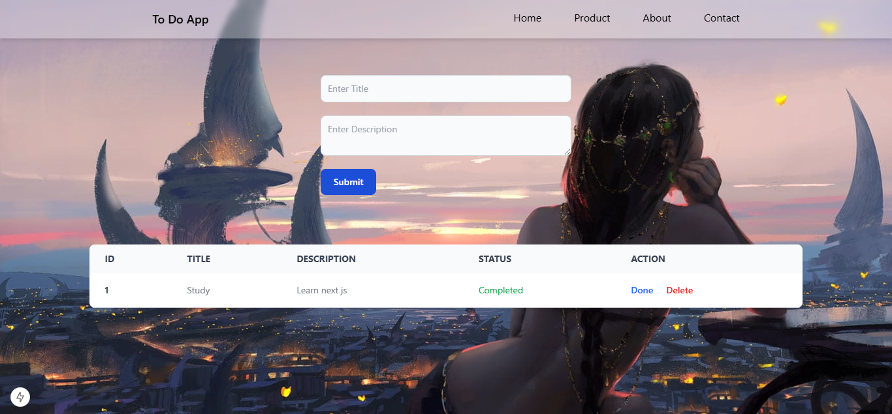

## Screenshots




## 🚀 Setup Instructions

1. Clone the repository:
   ```bash
   git clone https://github.com/supunrandika98/To-Do-List-NextJS
   cd To-Do-List-NextJS

## 🚀 Features

- Create new to do activities and real time display them in a table.
- Delete a activity.
- Update the status of activity as completed or pending.


## 🛠️ Installation & Setup

2. Install dependencies:

    ```bash 
    npm install

3. Create a .env file in the root folder and add the following:

    MONGO_URI=your_mongodb_connection_string_here

4. Start the server:

    npm run dev


Feel free to contribute! Open an issue or submit a pull request. 😊

